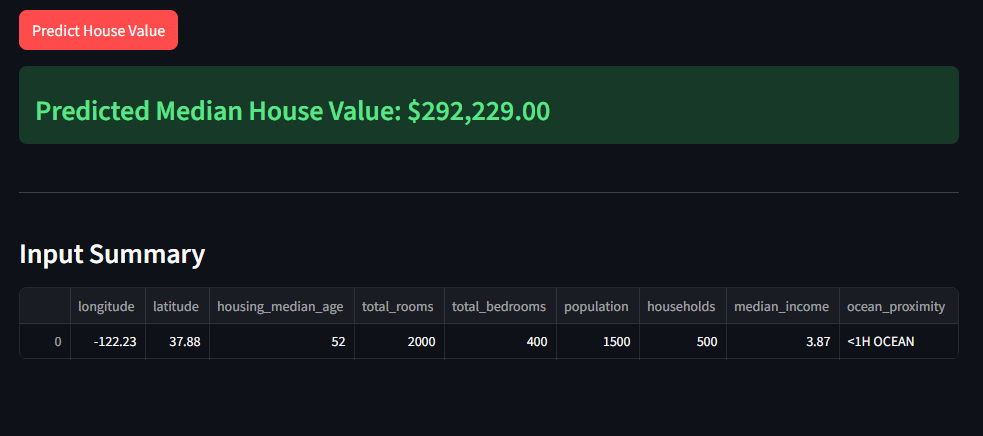

# 🏠 California Housing Price Prediction

A machine learning project that predicts median house values in California using the California Housing Dataset. This project includes a Random Forest model architecture and an interactive Streamlit web application for predictions and data visualizations.

**⚠️ Important Note**: The trained model file (`my_california_housing_model.pkl`) is **not included** in this repository due to file size constraints (~139MB). 

**Good News**: The application will **automatically download** the pre-trained model from Google Drive on first run, so you don't need to train it yourself unless you want to retrain with different parameters.

Alternatively, you can train the model yourself by running the Jupyter notebook (`notebook.ipynb`).



## 📋 Table of Contents

- [Problem Statement](#problem-statement)
- [Dataset Overview](#dataset-overview)
- [Methods & Architecture](#methods--architecture)
- [Results](#results)
- [How to Run](#how-to-run)
- [Project Structure](#project-structure)
- [Technologies Used](#technologies-used)
- [Future Improvements](#future-improvements)

## 🎯 Problem Statement

The goal of this project is to build a machine learning model that accurately predicts the median house value for districts in California based on various features such as location, demographics, and housing characteristics. This is a regression problem where we aim to minimize prediction errors (RMSE) to help real estate professionals, investors, and homeowners make informed decisions.

**Key Objectives:**
- Predict median house values in California districts
- Understand which features most influence house prices
- Provide an interactive platform for making predictions
- Visualize patterns and relationships in the housing data

## 📊 Dataset Overview

The California Housing Dataset contains information from the 1990 California census. The dataset includes:

### Features:
- **Longitude**: Longitude of the district
- **Latitude**: Latitude of the district
- **Housing Median Age**: Median age of houses in the district
- **Total Rooms**: Total number of rooms in the district
- **Total Bedrooms**: Total number of bedrooms in the district
- **Population**: Population of the district
- **Households**: Number of households in the district
- **Median Income**: Median income of households (in tens of thousands)
- **Ocean Proximity**: Categorical feature indicating proximity to the ocean
  - `<1H OCEAN`
  - `INLAND`
  - `ISLAND`
  - `NEAR BAY`
  - `NEAR OCEAN`

### Target Variable:
- **Median House Value**: Median house value in the district (in USD)

### Dataset Statistics:
- **Total Records**: ~20,640 districts
- **Missing Values**: Some districts have missing `total_bedrooms` values
- **Distribution**: Contains various income categories and geographic locations across California

## 🏗️ Methods & Architecture

### Data Preprocessing

1. **Data Cleaning**
   - Handled missing values using median imputation
   - Removed or imputed missing `total_bedrooms` values

2. **Feature Engineering**
   - **Ratio Features**: Created ratio-based features:
     - `bedrooms_ratio`: Total bedrooms / Total rooms
     - `rooms_per_house`: Total rooms / Households
     - `people_per_house`: Population / Households
   - **Log Transformations**: Applied logarithmic transformations to skewed features:
     - `total_bedrooms`, `total_rooms`, `population`, `households`, `median_income`
   - **Geographic Clustering**: Used K-Means clustering on latitude/longitude to create cluster similarity features using RBF kernels
   - **Categorical Encoding**: One-hot encoded `ocean_proximity` feature

3. **Pipeline Architecture**
   - **Numerical Pipeline**:
     - SimpleImputer (median strategy)
     - StandardScaler
   - **Categorical Pipeline**:
     - SimpleImputer (most frequent strategy)
     - OneHotEncoder
   - **Custom Transformers**:
     - `ClusterSimilarity`: Custom transformer for geographic clustering
     - Function transformers for ratio calculations

### Model Selection & Training

1. **Model**: Random Forest Regressor
   - Ensemble method combining multiple decision trees
   - Robust to overfitting
   - Provides feature importance insights

2. **Hyperparameter Tuning**:
   - Used RandomizedSearchCV for efficient hyperparameter optimization
   - Tuned parameters:
     - `n_clusters` (geographic clustering): 3-50
     - `max_features` (Random Forest): 2-20
   - Cross-validation with 3-fold CV

3. **Training Strategy**:
   - Stratified train-test split (80/20) based on income categories
   - Ensures representative distribution across income levels
   - Random state set for reproducibility

## 📈 Results

### Model Performance

The trained Random Forest model achieves the following performance metrics:

- **RMSE (Root Mean Squared Error)**: ~$47,000 - $50,000
  - This means predictions are typically within ~$47k-50k of actual values
  - For median house values around $200k, this represents ~20-25% error

- **Cross-Validation Performance**:
  - The model shows consistent performance across different folds
  - Validation error aligns with training error, indicating good generalization

### Key Insights

1. **Feature Importance**:
   - `median_income` is the most important feature (strongest predictor)
   - Geographic features (longitude, latitude, cluster similarities) are significant
   - Demographic features (population, households) contribute moderately

2. **Data Patterns**:
   - Strong correlation between median income and house values
   - Geographic location significantly impacts housing prices
   - Ocean proximity affects property values

### Visualizations

The application includes 10 comprehensive visualizations:

1. **Feature Histograms**: Distribution of all numerical features
2. **Income Category Distribution**: Bar chart of income categories
3. **Geographic Distributions**: 
   - Basic location scatter plot
   - With transparency overlay
   - Color-coded by house values and population
4. **Scatter Matrix**: Pairwise relationships between key features
5. **Income vs House Value**: Strong positive correlation visualization
6. **Population Distribution**: Raw and log-transformed distributions
7. **Housing Age Similarity**: RBF kernel similarity analysis
8. **Cluster Similarity Map**: Geographic clustering visualization with cluster centers

## 🚀 How to Run

### Prerequisites

- Python 3.7 or higher
- pip package manager
- Jupyter Notebook (for training the model)

### Installation

1. **Clone the repository**:
   ```bash
   git clone https://github.com/lewisnjue/california-housing-corporation.git
   cd california-housing-corporation
   ```

2. **Create and activate a virtual environment** (recommended):
   ```bash
   python -m venv env
   source env/bin/activate  # On Windows: env\Scripts\activate
   ```

3. **Install dependencies**:
   ```bash
   pip install -r requirements.txt
   ```

### Model Download (Automatic)

**✅ Default Behavior**: The application will automatically download the pre-trained model from Google Drive when you first run it. You don't need to do anything - just run the app and the model will be downloaded automatically on first use.

The model will be cached locally after the first download, so subsequent runs will be faster.

### Training the Model (Optional)

**Optional**: If you want to retrain the model with different parameters or explore the training process, you can train it yourself:

1. **Train the model using the Jupyter notebook**:
   ```bash
   # Install Jupyter if not already installed
   pip install jupyter
   
   # Launch Jupyter notebook
   jupyter notebook
   ```

2. **Open and run `notebook.ipynb`**:
   - The notebook contains the complete training pipeline
   - It will download the dataset automatically if needed
   - After training, it will save the model as `my_california_housing_model.pkl`
   - **Note**: Training may take several minutes depending on your hardware

3. **Verify the model file was created**:
   ```bash
   ls -lh my_california_housing_model.pkl
   ```
   You should see a file approximately 139MB in size.

### Running the Application

1. **Start the Streamlit app**:
   ```bash
   streamlit run app.py
   ```

2. **Access the application**:
   - The app will automatically open in your default browser
   - If not, navigate to `http://localhost:8501`

3. **Using the Application**:
   - **Model Prediction Page**: Enter housing features to get predictions
   - **Visualizations Page**: Click "Generate Visualizations" to view data insights

### Using the Model Directly

The model will be automatically downloaded from Google Drive on first use. No training required!

```python
from model import predict
import pandas as pd

# Prepare your data
data = pd.DataFrame({
    'longitude': [-122.23],
    'latitude': [37.88],
    'housing_median_age': [52.0],
    'total_rooms': [2000.0],
    'total_bedrooms': [400.0],
    'population': [1500.0],
    'households': [500.0],
    'median_income': [3.87],
    'ocean_proximity': ['NEAR BAY']
})

# Make prediction
prediction = predict(data)
print(f"Predicted median house value: ${prediction[0]:,.2f}")
```

## 📁 Project Structure

```
california-housing-corporation/
├── app.py                          # Streamlit web application
├── model.py                        # Model loading and prediction functions
├── visualizations.py               # Data visualization functions
├── my_california_housing_model.pkl # Trained model (pickle file - not in repo, must be trained)
├── requirements.txt                # Python dependencies
├── README.md                       # Project documentation
├── image.png                       # Project demo screenshot
├── notebook.ipynb                  # Jupyter notebook for training the model (REQUIRED)
├── datasets/                      # Housing dataset (auto-downloaded when training)
└── env/                            # Virtual environment (not in repo)
```

**Note**: The `my_california_housing_model.pkl` file is not tracked in git (see `.gitignore`). You must train the model using `notebook.ipynb` to generate this file before running the application.

## 🛠️ Technologies Used

- **Machine Learning**: 
  - scikit-learn (Random Forest, preprocessing, pipelines)
  - NumPy, Pandas (data manipulation)
  
- **Web Framework**: 
  - Streamlit (interactive web app)
  
- **Visualization**: 
  - Matplotlib (static plots)
  - Pandas plotting capabilities

- **Model Persistence**: 
  - joblib (model serialization)

- **Python Version**: 3.7+

## 🎨 Features

✅ **Interactive Prediction Interface**
- User-friendly input forms
- Real-time predictions
- Input validation and error handling

✅ **Comprehensive Visualizations**
- 10 different data visualizations
- Interactive exploration of dataset patterns
- Geographic and demographic insights

✅ **Production-Ready Model**
- Optimized hyperparameters
- Robust preprocessing pipeline
- Handles missing values and edge cases

✅ **Clean Architecture**
- Modular code structure
- Separation of concerns
- Easy to extend and maintain

## 🔮 Future Improvements

- [ ] Add model retraining functionality
- [ ] Implement model versioning
- [ ] Add more advanced visualizations (interactive plots with Plotly)
- [ ] Deploy to cloud platform (Heroku, AWS, etc.)
- [ ] Add API endpoints for programmatic access
- [ ] Implement model explainability (SHAP values)
- [ ] Add batch prediction capability
- [ ] Create Docker container for easy deployment
- [ ] Add unit tests and CI/CD pipeline
- [ ] Implement model monitoring and logging

## 📝 License

This project is open source and available under the MIT License.

## 👤 Author

**Lewis Njue**
- GitHub: [@lewisnjue](https://github.com/lewisnjue)

## 🙏 Acknowledgments

- California Housing Dataset from the 1990 Census
- Scikit-learn documentation and community
- Streamlit team for the amazing framework

---

**Important Notes**:
- The model file (`my_california_housing_model.pkl`) is **NOT** included in this repository due to size constraints (~139MB).
- Users must train the model by running `notebook.ipynb` before using the application.
- The model file is excluded via `.gitignore` to keep the repository lightweight.
- For production use, consider using model versioning, a proper model registry, or cloud storage solutions.

**Live Demo**: [https://california-housing-corporation-bs9ezlkmevpn29wffoyz3z.streamlit.app/]

For questions or contributions, please open an issue or submit a pull request! 🚀

